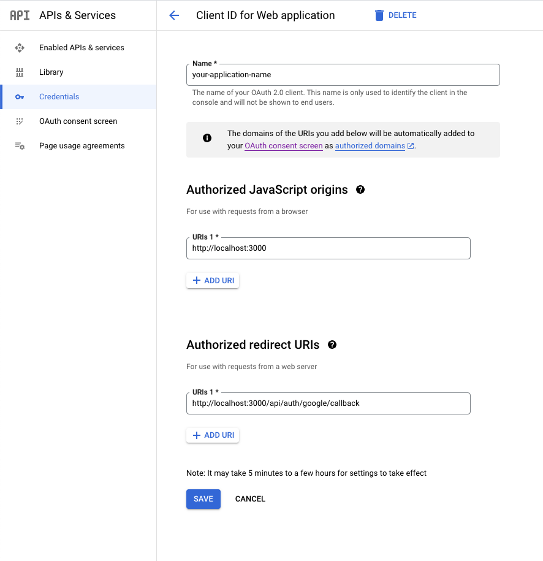

- [Update env file with environment variables](#update-env-file-with-environment-variables)
  - [Create a custom Iron implementation](#create-a-custom-iron-implementation)
  - [Handle sessions](#handle-sessions)
  - [Create API routes for login redirects](#create-api-routes-for-login-redirects)
  - [Create authentication helpers](#create-authentication-helpers)
  - [Authenticate routes](#authenticate-routes)

---

### Install Dependencies

The implementation outlined in this guide uses the following packages. Install
them using whatever package manager you're using for your app (`yarn`, `npm`,
`pnpm`):

```sh
iron-webcrypto
googleapis
jsonwebtoken
```

```sh
npm install iron-webcrypto googleapis jsonwebtoken
```

---

### Create a new app on Google Developer Console

Next you'll want to create a new application in the
[Google Developer Console](https://console.cloud.google.com/). Once you've
created a new app, make sure it's selected in the header, and go to
[https://console.cloud.google.com/apis/credentials](https://console.cloud.google.com/apis/credentials)
and click "Create credentials" and select "OAuth client ID".

When you've create a new OAuth Client ID, click on it's name to update the
redirect and origin information.



---

## Update env file with environment variables

Now that you have a Google application with credentials setup, you'll want to
add them to your `.env` file:

```sh:title=.env
# Google Auth secrets
GOOGLE_CLIENT_ID="YOUR_GOOGLE_CLIENT_ID"
GOOGLE_CLIENT_SECRET="YOUR_GOOGLE_CLIENT_SECRET"
GOOGLE_REDIRECT_URI="YOUR_GOOGLE_REDIRECT_URI"

# Application secrets
AUTH_SESSION_COOKIE="YOUR_PREFERRED_COOKIE_NAME"
AUTH_SESSION_SECRET="YOUR_PREFERRED_SECRET_FOR_HASHING_THE_COOKIE"
```

---

### Create a custom Iron implementation

I would usually use the `@hapi/iron` package out of the box to sign sessions,
but unfortunately the `crypto` package from NodeJS doesn't play nice in this
serverless NextJS context. Instead we'll use `iron-webcrypto` which allows us to
specify a custom implementation of the `crypto` package in `seal` and `unseal`
method calls.

We'll create 2 custom Iron implementations here, one for `seal` and another for
`unseal`. These functions will be used to encrypt and decrypt the cookies
respectively.

> Note that we're abstracting the secret variable here and passing
> `AUTH_SESSION_SECRET` to the functions by default. This simplifies the
> implementation throughout the app.

```ts:title=lib/iron.ts
import * as Iron from 'iron-webcrypto';

const { AUTH_SESSION_SECRET } = process.env;

const _crypto = globalThis.crypto;

type SealArgs = Parameters<typeof Iron.seal>;

/**
 *  Usage: Iron.seal(session, optionalOptions)
 */
function seal(object: SealArgs[1], options?: SealArgs[3]) {
  return Iron.seal(
    _crypto,
    object,
    AUTH_SESSION_SECRET,
    options ?? Iron.defaults,
  );
}

type UnsealArgs = Parameters<typeof Iron.unseal>;

/**
 *  Usage: Iron.unseal(cookie, optionalOptions)
 */
function unseal(sealed: UnsealArgs[1], options?: UnsealArgs[3]) {
  return Iron.unseal(
    _crypto,
    sealed,
    AUTH_SESSION_SECRET,
    options ?? Iron.defaults,
  );
}

const iron = {
  seal,
  unseal,
};

export default iron;
```

---

### Handle sessions

```ts:title=lib/api/auth.ts
import { JwtPayload } from 'jsonwebtoken'
import { NextRequest } from 'next/server'
import { cookies } from 'next/headers'

import Iron from '@/lib/iron'

const { AUTH_SESSION_COOKIE, NODE_ENV } = process.env

export interface UserSession {
  idToken: string
  issued: Date
  user: {
    id: string | number
    email: string
    name: string
    photoUrl: string
    firstName: string
    lastName: string
    locale: string
  }
}

export const setAuthCookie = (encrypted: string, expires: number) => {
  return cookies().set(AUTH_SESSION_COOKIE, encrypted, {
    expires: expires ?? undefined,
    httpOnly: true,
    secure: NODE_ENV === 'production',
    priority: 'high',
  })
}

export function createSession(
  decoded: JwtPayload,
  idToken: string,
  expires: number
): UserSession {
  const session: UserSession = {
    issued: Date.now(),
    expires,
    idToken,
    user: {
      id: decoded.userId,
      email: decoded.email,
      name: decoded.name,
      photoUrl: decoded.picture,
      firstName: decoded.given_name,
      lastName: decoded.family_name,
      locale: decoded.locale,
    },
  }

  return session
}

export async function encryptSession(session: UserSession) {
  return Iron.seal(session)
}

export async function decryptSession(
  session: string
): Promise<unknown | UserSession> {
  return Iron.unseal(session)
}
```

---

### Create API routes for login redirects

We will need two routes to make Google auth work:

1. `/api/auth/google/login`
1. `/api/auth/google/callback`

We'll hit the first URL using a button in our UI, which will redirect us to a
Google UI to choose an email account. If authentication is successful it will
redirect us to the second URL.

Start by creating a Google helper file under `lib`. This will provide us with
the authorization URL that we'll redirect users to.

```ts:title=lib/api/google.ts
import { google } from 'googleapis';

const scopes = ['openid', 'email', 'profile'];

export const oauth2Client = new google.auth.OAuth2(
  process.env.GOOGLE_CLIENT_ID,
  process.env.GOOGLE_CLIENT_SECRET,
  process.env.GOOGLE_REDIRECT_URI,
);

export const authorizationUrl = oauth2Client.generateAuthUrl({
  // 'online' (default) or 'offline' (gets refresh_token)
  access_type: 'online',
  /** Pass in the scopes array defined above.
   * Alternatively, if only one scope is needed, you can pass a scope URL as a string */
  scope: scopes,
  // Enable incremental authorization. Recommended as a best practice.
  include_granted_scopes: true,
});
```

Next, create the `/api/auth/google/login` route by creating
`/api/auth/google/login/route.ts` in the `app` directory, and add the following:

```ts:title=app/api/auth/google/login/route.ts
import { NextResponse } from 'next/server';
import { authorizationUrl } from '@/lib/api/google';

// Endpoint: /api/auth/google/login
export async function GET() {
  return NextResponse.redirect(authorizationUrl);
}
```

The last step is to create the `/callback` route. To do so, create a
`/api/auth/google/callback/route.ts` file under the `app` directory.

When the user hits the callback route, we'll check for a `code` query parameter
in the request and use it to fetch a token from the Google API. If the code is
valid, Google will return an object containing an `id_token` parameter. The
`id_token` string is a JWT payload containing the user profile information. We
will decode it using the `jsonwebtoken` package and use the contents to first
check if the user exists in the database. If the user exists, we'll create a
session, set it on a cookie and redirect the user to the logged in page.

If the email doesn't exist in our database already, we can choose to create a
new entry, or deny them based on an access-control list. The decision here will
depend on your use case.

> Note that we don't need any additional Google API to fetch the user
> information since the `email`, `picture`, `name`, `givenName` and `familyName`
> will be returned in the encoded `id_token`.

```ts:title=app/api/auth/google/callback/route.ts
import { NextRequest } from 'next/server';
import { encryptSession, setAuthCookie } from '@/lib/api/auth';

import * as jwt from 'jsonwebtoken';

import { oauth2Client as googleAuth } from '@/lib/api/google';
import { createSession } from '@/lib/api/auth';

// Endpoint: /api/auth/google/callback?code=&error=
export async function GET(req: NextRequest) {
  const code = req.nextUrl.searchParams.get('code') ?? '';
  const error = req.nextUrl.searchParams.get('error') ?? '';

  if (error) {
    console.error(error);
    // Map the error param to these expected errors: https://developers.google.com/identity/protocols/oauth2/web-server#authorization-errors
    return NextResponse.json(
      {
        data: {
          error,
        },
      },
      {
        status: 401,
        statusText: 'Unauthorized',
      },
    );
  }

  const { tokens } = await googleAuth.getToken(code);

  googleAuth.setCredentials(tokens);

  // Decode the `id_token` using jsonwebtoken
  const decoded = jwt.decode(tokens.id_token);

  try {
    let user = await db.user.findUnique({
      select: {
        id: true,
      },
      where: {
        email: decoded.email,
      },
    });

    if (!user || !user.id) {
      console.error(
        `"${decoded.email}" was not found in the DB. Creating user...`,
      );
      user = await prisma.user.create({
        data: {
          name: decoded.name,
          email: decoded.email,
          image: decoded.picture,
        },
      });
      if (!user) {
        throw new Error(`Failed to create user "${decoded.email}"`);
      }
    }

    decoded.userId = user.id;
  } catch (error) {
    console.error(`User "${decoded.email}" not found in database`, error);
    return NextResponse.redirect(APP_URL + '');
  }

  const expires = Date.now() + 60 * 60 * 1000
  const session = createSession(decoded, tokens.id_token, expires);
  const encrypted = await encryptSession(session);

  setAuthCookie(encrypted, tokens.expiry_date);

  console.log('Login successful. Redirecting...');
  return NextResponse.redirect(APP_URL + '/logged-in');
}
```

---

### Create authentication helpers

Next we'll create two helpers to allow us to easily authenticate page and API
routes: `authenticateRoute` and `authenticateApiRoute`.

```tsx:title=app/authenticate.ts
import { cookies } from 'next/headers';
import { redirect } from 'next/navigation';
import { NextRequest } from 'next/server';

import Iron from '@/lib/iron';
import { UserSession } from '@/lib/api/auth';

const { AUTH_SESSION_COOKIE } = process.env;

interface PageProps {
  params: { slug: string };
  searchParams: { [key: string]: string | string[] | undefined };
}

function removeCookieAndRedirect() {
  // Delete any invalid auth session
  cookies().delete(AUTH_SESSION_COOKIE);
  // Redirect to a login page
  return redirect('/login');
}

// Authenticate a client-side route
export function authenticateRoute(route: Function) {
  return async function (context: PageProps) {
    const session = cookies().get(AUTH_SESSION_COOKIE)?.value;

    if (!session) {
      removeCookieAndRedirect();
    }

    try {
      const decrypted = (await Iron.unseal(session)) as UserSession;
      return route({ ...context, user: decrypted?.user });
    } catch (error) {
      removeCookieAndRedirect();
    }
  };
}
```

```ts:title=app/authenticate.ts
// Authenticate a server-side route
export function authenticateApiRoute(apiRoute: Function) {
  return async function (request: NextRequest) {
    const session = cookies().get(AUTH_SESSION_COOKIE)?.value;

    if (!session) {
      return NextResponse.json(
        { data: 'Unauthorized' },
        {
          status: 401,
          statusText: 'Unauthorized',
        },
      );
    }

    try {
      const decrypted = await Iron.unseal(session);
      return apiRoute(request, decrypted);
    } catch (error) {
      console.error(error);
      return NextResponse.json(
        { data: 'Unauthorized' },
        {
          status: 401,
          statusText: 'Unauthorized',
        },
      );
    }
  };
}
```

---

### Authenticate routes

Now that you have authentication in place, you can protect your routes as you
wish by wrapping the exports in `authenticateRoute` or `authenticateApiRoute`
from `app/authenticate.ts`.

```tsx:title=app/your-route/page.tsx
import { authenticateRoute } from '../authenticate';

export default authenticateRoute(YourRoute);

async function YourRoute(context) {
  return <div>Your authenticated route</div>;
}
```

```ts:title=app/api/model/route.ts
import type { NextRequest } from 'next/server';

import { UserSession } from '@/lib/api/auth';
import { authenticateApiRoute } from '@/app/authenticate';

export const POST = authenticateApiRoute(create);

async function create(request: NextRequest, session: UserSession) {
  // Route handling... Notice the user `session` is available here.
}
```

---

And there you have it - Google authentication with Next. Obviously this is a
boilerplate to get you started, but much more can be done here to make the
implementation more secure.
